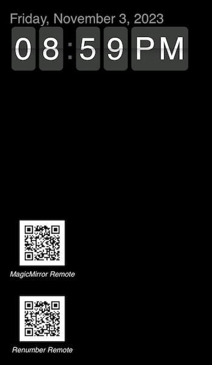

# MMM-QR-Remote-Link

A [MagicMirror²](https://magicmirror.builders/) module that will display a QR code with a link to a local module.

## Why?

You can display a QR code to the MagicMirror remote. I'm using it for that and to display a QR code with a link to another module.

It uses the [node-qrcode](https://www.npmjs.com/package/qrcode?activeTab=readme) NPM package.

## Screenshot



## Installation

```shell
cd ~/MagicMirror/modules
git clone https://github.com/JasonVonKrueger/MMM-QR-Remote-Link
cd MMM-QR-Remote-Link
npm install
```

## Configuration

```javascript
{
    module: 'MMM-QR-Remote-Link',
    position: 'bottom_left',
    config: {
        size: 80, // in pixels...height and width are set to this
        text: 'MagicMirror Remote',
        endpoint: '/remote.html' // must start with a "/"
    }
},
{
    module: 'MMM-QR-Remote-Link',
    position: 'bottom_left',
    config: {
        size: 80, // in pixels...height and width are set to this
        text: 'Renumber Remote',
        endpoint: '/MMM-ReNumber/remote.html' // must start with a "/"
    }
},
```
